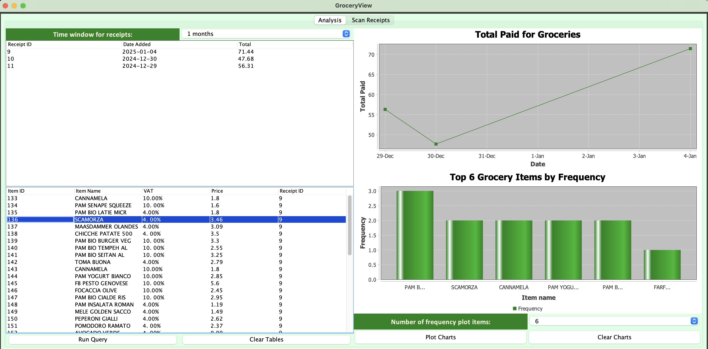
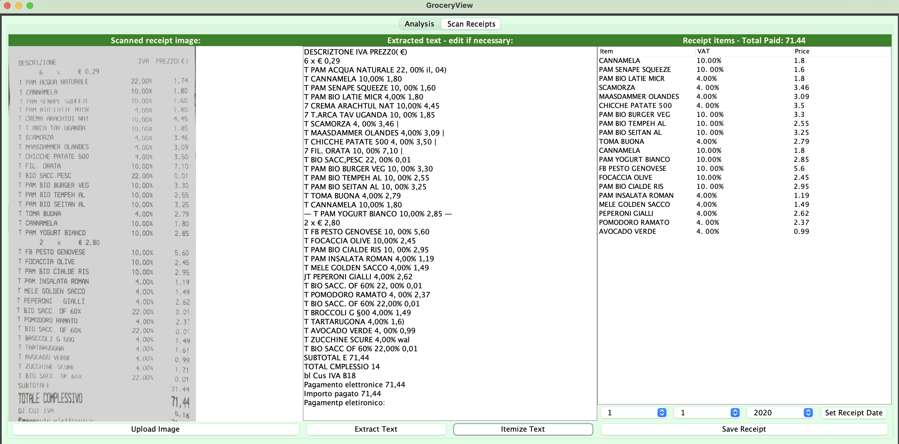
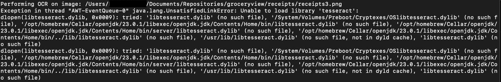
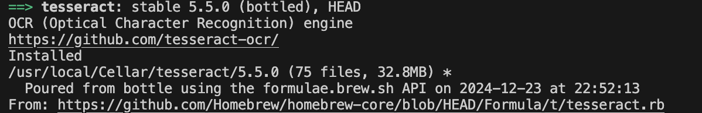
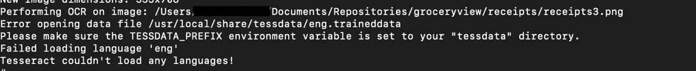

# Groceryview
### Hobby project

Application to keep track of one's spending at the supermarket by scanning receipts and memorizing items in a database.
The app can produce simple charts to display trends in one's purchase of groceries.
The user is required to take a picture of their supermarket receipts (for instance one could use the laptop webcam to take the pictures).
Optical character recognition is then used to scan the receipt picture for grocery items.
The receipt data (i.e. the total paid and date) and the items data is stored in a sqlite database.

## Launching the app through java command line:
- (On mac) Install tesseract with homebrew:
    `brew install tesseract`
- Launch the app by running the maven shaded JAR file:
    `java  -jar ./groceryview/target/groceryview-0.0.jar`

## App view:
### Analysis tab
- Analyse the results:
- Query the database for receipts and the grocery items in a certain time-window
- Display receipt total paid over time in a time-series chart
- Display most frequent items in receipts (can select how many items to display in the chart)

### Scan tab
- Scan your receipt:
- Upload an image of your receipt
- Use optical character recognition to extract text from the image
- Corrext errors in case it's needed
- Save the receipt items to the database

## Fixes:
Launching the app requires installation of `libtesseract.dylib`. In case an error like the following appears when launching the app:

follow these instructions to make the library accessible to the app:
- Install it with homebrew:
    `brew install tesseract`
- Find the installation location:
    `brew info tesseract`
on my machine it is here:

- Then copy the library to one of the locations which jna is trying to open. E.g. On mac one can copy it to:
    `cp /usr/local/Cellar/tesseract/5.5.0/lib/libtesseract.dylib /Library/Java/JavaVirtualMachines/temurin-23.jdk/Contents/Home/bin/./libtesseract.dylib`
- or to:
    `cp /usr/local/Cellar/tesseract/5.5.0/lib/libtesseract.dylib /System/Library/Frameworks/tesseract.framework/tesseract`
- or to any similar location specified by the error message (above).

In case the following error appears:

copy the `tessdata` folder to `/usr/local/share/tessdata`, or any similar location specified by the error. On my mac:
`cp -r /usr/local/Cellar/tesseract/5.5.0/share/tessdata /usr/local/share/tessdata`