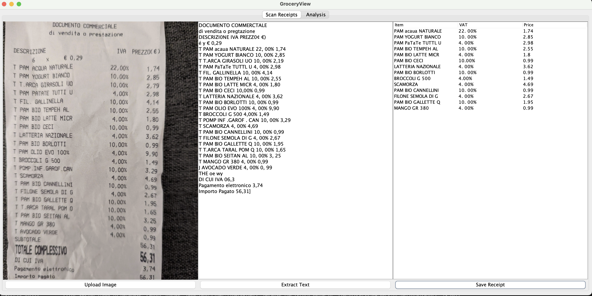

# Groceryview

Application to keep track of one's spending at the supermarket by scanning receipts and memorizing items in a database.
The app can produce simple charts to display trends in one's purchase of groceries.
The user is required to take a picture of their supermarket receipts (for instance one could use the laptop webcam to take the pictures).
Optical character recognition is then used to scan the receipt picture for grocery items.
The receipt data (i.e. the total paid and date) and the items data is stored in a sqlite database.

# to launch the app:
One needs to install libtesseract.dylib.
Install it with homebrew
`brew install tesseract`
On mac one can copy it to:
`cp /usr/local/Cellar/tesseract/5.5.0/lib /Library/Java/JavaVirtualMachines/temurin-23.jdk/Contents/Home/bin/./libtesseract.dylib`
or to:
`cp /usr/local/Cellar/tesseract/5.5.0/lib /System/Library/Frameworks/tesseract.framework/tesseract`

## App view:
- Scan your receipt:

- Analyse the results
